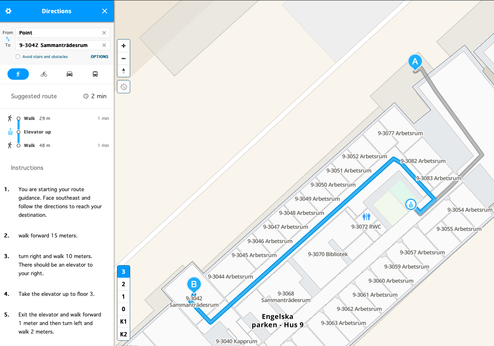
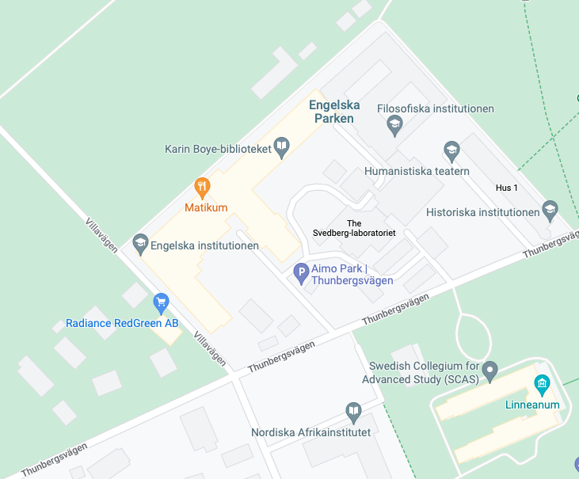
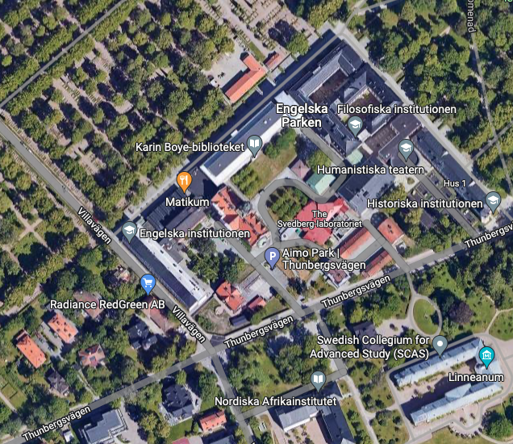

# Spatial data
This and succeeding modules [3.5 QGIS](./3_5_qgis.md) and [3.6 QGIS](./3_6_qgis.md) will introduce you to the structure, capability, and usage of software applications for working with spatial data. Spatial data applications allows for the integration, analysis and visualisation of spatial data collections, for producing maps, and for understanding spatial relationships.

## Introduction
'Spatial data' defines any type of standardised information that incorporates a spatial dimension. A spatial dimension can be relational, defining spatial relationships between entities (i.e. something is inside, outside, or next to something else), or geographical, defining location and extent within a geometric system. While we will primarily be working with the latter type of spatial data in this and subsequent modules, it is important to remember that relational spatial data also has uses of relevance for cuneiform studies, for example in the study and analysis of historical geographies.

### Spatial data applications

The present module will introduce you to the concept and basic structure of [Geographical Information Systems (GIS)](https://en.wikipedia.org/wiki/Geographic_information_system) and their usage. A GIS is a data structure or computer application that can store, manipulate, and present a complex range of data according to both spatial and attribute parameters using a wide range of tools.

A related type of application are [web maps](https://en.wikipedia.org/wiki/Web_mapping), such as [Google Maps](http://maps.google.com) or [Bing Maps](https://www.bing.com/maps), or any other static or interactive geographical visualisation of data found online. While these utilise many of the same functions as GIS software, they are primarily designed for data visualisation and consumption, and less for data generation and manipulation.

The first conceptual definition of a GIS was made by British geographer [Roger Tomlinson](https://en.wikipedia.org/wiki/Roger_Tomlinson) in 1968. The [Canada Geographical Information System (CGIS)](https://en.wikipedia.org/wiki/Canada_Geographic_Information_System), the first ever operational GIS, was launched in the 1960ies by the Canadian government as a tool for land resource mapping and analysis. 

Structuring data according to spatial characteristics has a great many applications - some of which you have no doubt made use of yourself in everyday life. Aspects of GIS are used in [indoor positioning systems](https://en.wikipedia.org/wiki/Indoor_positioning_system) and wayfinding applications, such as [MazeMap](https://www.mazemap.com) used for the Uppsala University campus.

If you haven't used indoor positioning systems, you most certainly have used [Google Maps](http://maps.google.com) or similar applications for mobile and desktop devices. These services rely on the same basic data elements as the indoor positioning systems, but are true geographic applications, in that they rely on geographical coordinates.

They also typically include the option to switch between two basic types of views; one using [vector graphics](https://en.wikipedia.org/wiki/Vector_graphics) (such as the map of Engelska Parken campus above), and one using [raster graphics](https://en.wikipedia.org/wiki/Raster_graphics) (such as the map of Engelska Parken campus below). We will get back to the essential differences between these two types of data in a moment.

If you have used [Google Maps](http://maps.google.com), chances are that you have also encounted [virtual globe](https://en.wikipedia.org/wiki/Virtual_globe) applications such as [Google Earth](https://earth.google.com/web/). This is another type of spatial data application that employs 3D software models to visualise the surface of the Earth (or other planets), typically using satellite imagery.

These are some examples of common spatial data applications for visualising or working with geographical information. A GIS software package is the desktop application that allows you to create, manipulate, store and visualise this type of data yourself. Let us now take a look at the structure of a GIS.

### Spatial data types
A GIS stores spatial data in **one** of **four** different types; **point**, **line**, **polygon**, and **raster**

* A **point** is a single vector location, which has no extent
* A **line** is a geometric shape with no width between two or more vector points
* A **polygon** is a contiguous surface between three or more vector points

**Point**, **line**, and **polygon** are vector graphics. The fourth type is **raster**, or **raster graphics**.

* **Raster** data consists of an orthogonal (square) grid of rows and columns of cells in which each cell holds a single value (colour, altitude, or temperature, for example)

The different structure of **vector** and **raster** graphics means that they are stored in different file formats. Where **vector** grphics can be stored as text, **raster** graphics are typically stored as images. This has an impact on the way in which data can be imported into a GIS. A set of GPS points, for example, will be stored as a list of numbers, in **vector** format. A scan of a print map, on the other hand, will be stored as an image, in **raster** format.

### Attribute data types
Next to spatial data types, a GIS will also include attribute data types. These are tabular data that is linked to spatial data records, holding quantitative or qualitative information about vector data types such as **points**, **lines**, and **polygons**. Attribute data can come in many formats, some of which you probably know. A common and simple file format to use are delimited text files, such as Comma Separated Values, using the file extension .csv, and Tab Separated Values, or .tsv. Attribute data files can also be in the Excel file format .xls or .xlsx, and a large variety of other tabular text data formats.

A GIS orders different spatial data types and files into different **layers** in a single data frame. Overlay of different spatial data sets enables us to select and analyse these data sets based on spatial and associated attribute conditions. If you have ever worked with Adobe Illustrator, Adobe Photoshop, or Adobe InDesign, you will be familiar with this way of ordering data within a single coordinate system. The main difference in functional terms is that a GIS uses a geographical coordinate reference system, making it useful for spatial data. But it is perfectly possible to draw a flower or a sunset in a GIS, should you want to.

### Coordinate reference systems
A [coordinate reference system](https://en.wikipedia.org/wiki/Spatial_reference_system) or a CRS defines the spatial frame of a GIS. All types of spatial data are represented in GIS through **coordinates** (X, Y - and sometimes Z). Coordinates represent a specific location within a defined **coordinate reference system**. If you have coordinates for a given dataset, but do not know the coordinate reference system that they relate to, you will not be able to place the data correctly in space. A GIS can integrate and present data derived from many different **coordinate reference systems**.

Generally speaking, there are two different types of coordinate reference system in a GIS. One is a [geographic CRS](https://en.wikipedia.org/wiki/Geographic_coordinate_system), which models the Earth as a sphere and uses longitude and latitude coordinates (degrees-minutes-seconds, or DMS, or its numerical conversion, decimal degrees). Another is a [projected CRS](https://en.wikipedia.org/wiki/Projected_coordinate_system), which represents part of the Earth on a planar surface using a projection (conversion) of three-dimensional space to a two-dimensional surface.

### The interface of a GIS
Summing up the above elements, the user interface of a GIS will therefore typically contain the following principal elements:
* A toolbar, including some or all of the tools that can be deployed to create, manipulate, store, analyse, and visualise spatial and attribute data
* A layer index, listing all data files loaded to the current project
* A viewer, showing the spatial data frame of the GIS
* A project coordinate reference system

### Summary
To sum up this introduction, let us rehearse a couple of central points about GIS:

* Remember, GIS is both a computational tool and a form of data storage and data analysis framework
* GIS integrates structured data that has both spatial characteristics and attribute characteristics
* This means that GIS can be used to order, integrate, and analyse large amounts of data deriving from multiple spatial locations

#### Applications
* [Google Earth Pro](https://www.google.com/earth/about/versions/) - a virtual globe desktop application, using Google satellite imagery
* [QGIS](https://www.qgis.org/) - a free open source GIS

#### Resources
* [Gregory and Ell 2007]
* [Conolly and Lake 2006]